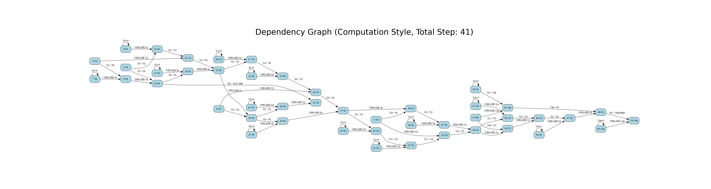

# Description of approximation method
The approximate method we use is based on the following three levels:
- Ignore the carry or cout of the 4-2 compression adder. But control it from a more precise level
- 4-2 Approximation of the compressor logic expression level. The approximation here is mainly for the approximation of the LUT table
- Mix the previous two approximations to balance the effects of the wrong LUT table and ignoring the carry and cout carry as much as possible.
# Method 1: Ignore the carry or cout of the 4-2 compression adder. 
We found that ignoring the Carry or Cout of the 4-2 compression adder at the bit level will lead to a serious drop in accuracy, and it is troublesome to manually consider the coupling between different 4-2 compression adders to handle exceptions. In order to simplify manual processing and fine-grained control of the 4-2 compression adder's carry or not, we proposed a heuristic-based 4-2 compression adder selection model.
## How it work
In order to be able to use heuristic methods, we need to specify a good evaluation metric that helps us determine how many 4-2 compressors can be approximated with a good level of error.
### Determination of evaluation indicators
The evaluation indicators we use here mainly include two aspects: 1. Ignoring the impact of a single or multiple 4-2 compression-based adders on the calculation steps of the entire 8-bit multiplier. 2. Ignoring the error impact and variance of a single or multiple 4-2 compression-based adders on the entire 8-bit multiplier LUT table.
####  Processing of evaluation matricx 1
1. Here we mainly construct three different adders based on the paper `Power-Area Efficient Serial IMPLY-based 4-2 Compressor Applied in Data-Intensive Application` and construct a logical expression tree according to the algorithm flow.

3. We can determine the predecessors that carry and cout depend on based on the established logical expression tree, and delete these predecessors to determine the number of steps that can be reduced.

4. And we can construct a larger multiplication logic expression tree to detect the impact of the change of the carry of a 4-2 compression-based adder on the adder (hereinafter referred to as a) that depends on its result, so as to update the adder process of a. In this way, we can save steps in the entire multiplication logic.
#### Processing of evaluation matricx 2
1. Based on the indicator 2, we can traverse the 8-bit input according to the ignored situation to construct a new LUT table for comparison with the standard LUT table.
2. In this way, we can calculate the error and standard deviation between the new LUT table and the old LUT table.
### Heuristics
Here we hope to calculate the approximate number of 4-2 compression-based adders and approximate Carry or Cout selections for different choices based on simulated annealing or genetic algorithm.

# Method 2: 4-2 Approximation of the compressor logic expression level.
TBD
# Method 3: Mix the method 1 and method 2
TBD

# Automatically generate csv files for each step of LTSpice
Based on the number of logical expressions constructed by the evaluation index of the Method, we can automatically generate all csv files based on the selected registers and input and output, avoiding the trouble of manual writing.

# Evaluation
TBD

# Todo
- [x] Determine the architecture：Sequence-based 4-2 compression-based adder
- [x] Baseline evaluation for automic
- [ ] Baseline power analysis using LTSpice
- [x] Approximate method 1 Dependency graph construction
- [ ] Complete approximate step calculation
- [ ] Heuristics and Evaluation
- [ ] Approximate method 2 LUT table generation and Logical Processing Flow
- [ ] Approximate Method 2 Evaluation
- [ ] Implementation and evaluation of combined approximation method 1 and approximation method 2
