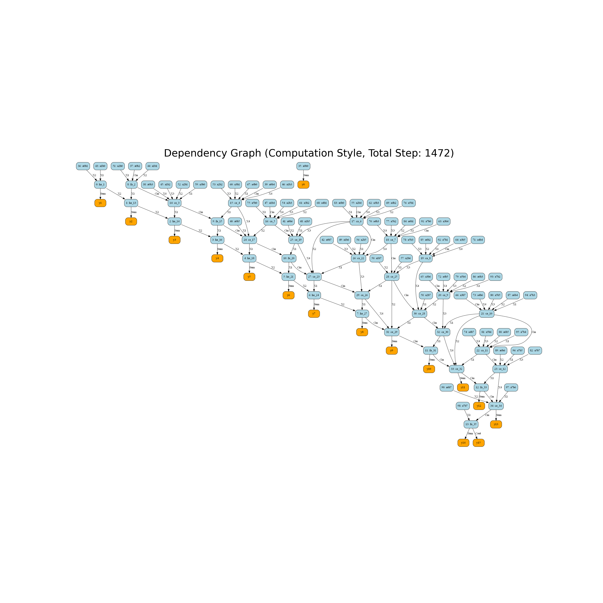

# Description of approximation method
The approximate method we use is based on the following three levels:
- Ignore the carry or cout of the 4-2 compression adder. But control it from a more precise level
- 4-2 Approximation of the compressor logic expression level. The approximation here is mainly for the approximation of the LUT table
- Mix the previous two approximations to balance the effects of the wrong LUT table and ignoring the carry and cout carry as much as possible.
# Method 1: Ignore the carry or cout of the 4-2 compression adder. 
We found that ignoring the Carry or Cout of the 4-2 compression adder at the bit level will lead to a serious drop in accuracy, and it is troublesome to manually consider the coupling between different 4-2 compression adders to handle exceptions. In order to simplify manual processing and fine-grained control of the 4-2 compression adder's carry or not, we proposed a heuristic-based 4-2 compression adder selection model.
## How it work
In order to be able to use heuristic methods, we need to specify a good evaluation metric that helps us determine how many 4-2 compressors can be approximated with a good level of error.
### Determination of evaluation indicators
The evaluation indicators we use here mainly include two aspects: 1. Ignoring the impact of a single or multiple 4-2 compression-based adders on the calculation steps of the entire 8-bit multiplier. 2. Ignoring the error impact and variance of a single or multiple 4-2 compression-based adders on the entire 8-bit multiplier LUT table.
####  Processing of evaluation matricx 1
1. Here we mainly construct three different adders based on the paper `Power-Area Efficient Serial IMPLY-based 4-2 Compressor Applied in Data-Intensive Application` and construct a logical expression tree according to the algorithm flow.


3. We can determine the predecessors that carry and cout depend on based on the established logical expression tree, and delete these predecessors to determine the number of steps that can be reduced.

4. And we can construct a larger multiplication logic expression tree to detect the impact of the change of the carry of a 4-2 compression-based adder on the adder (hereinafter referred to as a) that depends on its result, so as to update the adder process of a. In this way, we can save steps in the entire multiplication logic.
#### Processing of evaluation matricx 2
1. Based on the indicator 2, we can traverse the 8-bit input according to the ignored situation to construct a new LUT table for comparison with the standard LUT table.
2. In this way, we can calculate the error and standard deviation between the new LUT table and the old LUT table.
### Heuristics
Here we hope to calculate the approximate number of 4-2 compression-based adders and approximate Carry or Cout selections for different choices based on simulated annealing or genetic algorithm.

# Method 2: 4-2 Approximation of the compressor logic expression level.
In this step, we focused on analyzing the source of step 44 in the paper and tried to optimize it.  
In particular, we use Python to help us verify the accuracy, see `approximate_logic.py`.  
We mainly approximate the Xor part, because we found that the repeated part of Sum, Cout, and Carry in step 44 of the paper comes from Xor. In order to minimize the loss of accuracy, we mainly approximate X1 Xor X2 Xor X3 and the logical expressions of Carry and Sum.
|acc|Sum|Cout|Carry|Saved Step|
|-|-|-|-|-|
||0.5625|0.8125|1|23|

The following is the approximate logical expression we obtained from our research：  
$$
\begin{align}
S &=\overline{X_3}+\overline{X_1}\cdot \overline{X_2}+X_1\cdot X_2 \\
Cout &= X_1\cdot X_2+X_3\cdot (X_1\oplus X_2)\\
Carry &= S\cdot X_4+C_{in}\\
Sum &= \overline{(S,X_4)\oplus C_{in}}
\end{align}
$$

# Method 3: Mix the method 1 and method 2
Here we combine method 1 and method 2.  
We hope to use a `heuristic algorithm` to strike a balance between ignoring carries and using approximate adders, saving as many steps as possible while maintaining the accuracy of the multiplier.

# Automatically generate csv files for each step of LTSpice
Based on the number of logical expressions constructed by the evaluation index of the Method, we can automatically generate all csv files based on the selected registers and input and output, avoiding the trouble of manual writing.

# Evaluation
TBD

# How to use the code
The core provides integrated `full_adder`, `half_adder`, `compressor_4_2` (approximate versions are also included here). They can be called very easily.

```python
from core import HalfAdder, Compressor_4_2,FullAdder,AND_GATE, Multiplier

ca=Compressor_4_2() # init a 4-2 compressor
ca.visualize_dependency_graph() # store denpendecy graph
ca.operation_step() # simulate logic step, should be 44
ca.convert_mode() # can convert approximate mode or convert to exact mode, and keep the context dependency of the multiplier
ca.drop_output() # can automatic drop carry or cout or sum.
ca.support_drop_type() # check which type can support, like half adder only support sum. However, we only recommend and specify in the code that we ignore the carry bit.

mul=Multiplier()
mul.operation_step() # total step for whole multiplier
mul.drop_adder_Carry_or_Cout(1,"Cout") # drop adder according to adder index or adder name
mul.visualize_dependency_graph() # Multiplier level dependency visualization
mul.support_drop_type()
mul.convert_mode(1) # conver the adder's mode
mul.write_csv_file() # automatic generate csv file for LTspice
mul.forward({"a":[0,0,0,0,0,0,0,0],"b":[0,0,0,0,0,0,0]}) #According to the dependency, calculate the forward function of each adder to get the output and summarize the result output
```
Under `mul_step` is a csv file of all the registers that we automatically generated using       `write_to_csv_file`. 16 inputs registers, 16 outputs registers, s1, s2, s3 (used only as transfer variables) registers. 64 w registers

# Todo
- [x] Determine the architecture：Sequence-based 4-2 compression-based adder
- [x] Baseline evaluation for automic
- [ ] Baseline power analysis using LTSpice
- [x] Approximate method 1 Dependency graph construction
- [x] Complete approximate step calculation
- [ ] Heuristics and Evaluation
- [x] Approximate method 2 LUT table generation and Logical Processing Flow
- [x] Approximate Method 2 Evaluation
- [ ] Implementation and evaluation of combined approximation method 1 and approximation method 2
